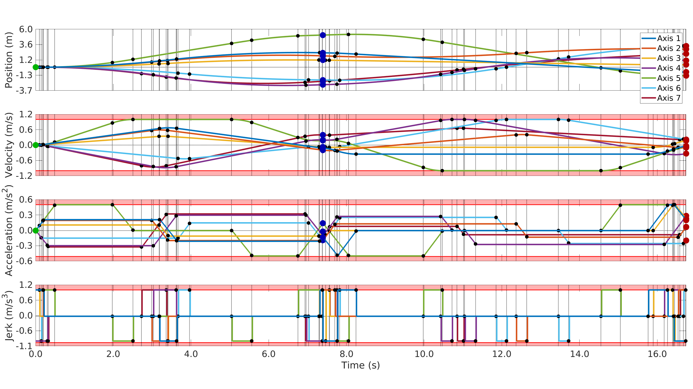

# TopiCo - Time-optimal Trajectory Generation and Control
**TopiCo** efficiently (<<1ms per axis per trajectory) generates smooth, dynamically feasible, time-optimal, third-order trajectories from arbitrary start- to arbitrary target-states. Trajectories comply with asymmetric state- and input constraints and successfully handle initial states that lie outside of the allowed state space. Trajectories for an arbitrary number of axes are generated simultaneously, and three different approaches can temporally synchronize them. TopiCo can also target partially defined target states, exploiting the undefined degrees of freedom to speed up the trajectory. Synchronized trajectories targeting incompletely defined target states either maximize or minimize the free degrees of freedom. TopiCo can estimate and actively compensate global acceleration biases, thus enhancing the disturbance rejection capabilities. Besides third-order trajectories, TopiCo can also generate second- and first-order trajectories. TopiCo also generates interception trajectories targeting dynamic waypoints.

TopiCo has been successfully used as model predictive controller on different micro aerial vehicles, in different research projects and robotic competitions.



# Papers describing the Approach
Marius Beul and Sven Behnke: [Fast Full State Trajectory Generation for Multirotors](http://ais.uni-bonn.de/papers/ICUAS_2017_Beul_Trajectory_Generation.pdf)  
In Proceedings of International Conference on Unmanned Aircraft Systems (ICUAS), Miami, FL, USA, June 2017

Marius Beul and Sven Behnke: [Analytical Time-optimal Trajectory Generation and Control for Multirotors](http://ais.uni-bonn.de/papers/ICUAS_2016_Beul.pdf)  
In Proceedings of International Conference on Unmanned Aircraft Systems (ICUAS), Arlington, VA, USA, June 2016


# How to cite?
```
@INPROCEEDINGS{beul2017icuas,
  author = {Marius Beul and Sven Behnke},
  title = {Fast Full State Trajectory Generation for Multirotors},
  booktitle = {Proceedings of International Conference on Unmanned Aircraft Systems (ICUAS)},
  year = 2017,
  month = 6,
  address = {Miami, FL, USA},
  doi = {10.1109/ICUAS.2017.7991304},
  url = {https://github.com/AIS-Bonn/TopiCo}
}
```


# Getting started
run `example` in MATLAB.
The variable `index_example` selects the example.

- Example 1 generates a predefined trajectory with two consecutive waypoints for a single axis.  
- Example 2 generates a predefined trajectory with two consecutive waypoints for a single axis with changing bounds and infeasible start state for the second waypoint.  
- Example 3 generates a predefined second order trajectory with two consecutive waypoints for a single axis.  
- Example 4 generates a predefined synchronized trajectory with two consecutive waypoints for two axes.  
- Example 5 generates a predefined trajectory with two consecutive waypoints for a single axis with undefined (NaN) components of the first waypoint.  
- Example 6 generates a random trajectory with up to five consecutive waypoints for up to seven axes.


# Meaning of variables and size of matrices

Given that the trajectory consists of m axes and n consecutive waypoints, the variables have the following size:


| Variable         | Type   | Size        |
|------------------|--------|-------------|
| State_start      | double | (m x 3)     |
| Waypoints        | double | (m x 5 x n) |
| V_max            | double | (m x n)     |
| V_min            | double | (m x n)     |
| A_max            | double | (m x n)     |
| A_min            | double | (m x n)     |
| J_max            | double | (m x n)     |
| J_min            | double | (m x n)     |
| A_global         | double | (m x 1)     |
| b_sync_V         | bool   | (m x n)     |
| b_sync_A         | bool   | (m x n)     |
| b_sync_J         | bool   | (m x n)     |
| b_sync_W         | bool   | (m x n)     |
| b_rotate         | bool   | (n-1 x n)   |
| b_hard_vel_limit | bool   | (m x n)     |
| b_catch_up       | bool   | (m x n)     |
| direction        | int8   | (m x n)     |
| ts_rollout       | double | (1 x 1)     |
|                  |        |             |
| J_setp_struct    | struct | (m x 1)     |
| solution_out     | int32  | (m x n)     |
| T_waypoints      | double | (m x n)     |
| P                | double | (m x ?)     |
| V                | double | (m x ?)     |
| A                | double | (m x ?)     |
| J                | double | (m x ?)     |
| t                | double | (m x ?)     |


### State_start
Start state of the whole trajectory. The state consist of position, velocity and acceleration per axis

### Waypoints
List of waypoints the trajectory has to cross. Each waypoint is 5-dimensional, consisting of position, velocity, acceleration, velocity prediction, and acceleration prediction (currently not functional) per axis.  
Waypoints can have undefined (NaN) components, but at least one derivative (position, velocity or acceleration) has to be defined. Undefined components will be chosen so that the trajectory is time-optimal and does not violate constraints.
The velocity prediction variable describes the motion of the waypoint. This enables the method to generate interception trajectories. Velocity and acceleration are waypoint-centric. This means, if a waypoint is moving, the allocentric velocity in the waypoint is waypoint velocity + waypoint velocity prediction.

### V_max
Maximum velocity per axis per waypoint. The limit is per axis. So, the relative velocity difference of a waypoint can exceed this value, if the waypoint is moving. If any limit is set to Inf, the computation of the trajectory speeds up further, so remove any unnecessary bounds.

### V_min
Minimum velocity per axis per waypoint. The limit is per axis. So, the relative velocity difference of a waypoint can exceed this value, if the waypoint is moving. If any limit is set to Inf, the computation of the trajectory speeds up further, so remove any unnecessary bounds.

### A_max
Maximum acceleration per axis per waypoint. If any limit is set to Inf, the computation of the trajectory speeds up further, so remove any unnecessary bounds.

### A_min
Minimum acceleration per axis per waypoint. If any limit is set to Inf, the computation of the trajectory speeds up further, so remove any unnecessary bounds.

### J_max
Maximum jerk per axis per waypoint. By setting this to Inf, the order of the trajectory can be reduced.

### J_min
Minimum jerk per axis per waypoint. By setting this to Inf, the order of the trajectory can be reduced.

### A_global
Global acceleration. This can be for example constant wind when controlling an MAV.

### b_sync_V
Should the velocity of faster axes be reduced to synchronize with the slowest axis. When b_sync_V, b_sync_A, and b_sync_J are switched on (and b_sync_W switched off), the trajectory with the smallest deviation from the time-optimal trajectory is chosen.

### b_sync_A
Should the acceleration of faster axes be reduced to synchronize with the slowest axis? When b_sync_V, b_sync_A, and b_sync_J are switched on (and b_sync_W switched off), the trajectory with the smallest deviation from the time-optimal trajectory is chosen.

### b_sync_J
Should the jerk of faster axes be reduced to synchronize with the slowest axis? When b_sync_V, b_sync_A, and b_sync_J are switched on (and b_sync_W switched off), the trajectory with the smallest deviation from the time-optimal trajectory is chosen. This feature is currently not functional.

### b_sync_W
Should all axes be synchronized by waiting? This means that faster axes wait before starting or after finishing at the waypoint for the slowest axis. This only works when velocity and acceleration of either the start- or target state is zero. This setting superceeds b_sync_V, b_sync_A, and b_sync_J, since it is computationally much cheaper. So when b_sync_W is true, the settings of b_sync_V, b_sync_A, and b_sync_J are ignored and it is synchronized by waiting. This setting however results in non-straight multidimensional trajectories.

### b_rotate
Rotate the axes so that the x-axis points into the direction of movement between waypoints. This only works with more than one axis. Considering a 3-dimensional trajectory (x,y,z), the coordinate system is rotated about the z-axis.

### b_hard_vel_limit
This only affects trajectories that start in an infeasible (outside of allowed velocity or acceleration margins) state. If the start velocity is infeasible, should we return to the allowed bounds as fast as possible (b_hard_vel_limit ==  true) resulting in the shortest possible time outside the limits, or is it allowed to stay outside a little longer for shortest total time and a smoother trajectory. See also Example 2. This parameter also affects axes that are slowed down to synchronize with the slowest axis. If the parameter is false, synchonized axes can stay outside bounds for a significant time.

### b_catch_up
Should later synchronized axes try to catch up with unsynchronized previous axes? So, should they catch up in time to synchronize again?

### direction
When parts of the waypoint are undefined, should the undefined degrees of freedom be maximized (direction == 1) or minimized (direction == -1).

### ts_rollout
Defines the timesteps at which the trajectory is sampled. See variable _t_rollout_ below.

### J_setp_struct
This variable outputs the switching times of the trajectory with the corresponding jerks. This is why we do all the math...!

### solution_out
This encodes the cases of the time-optimal and synchronized trajectories.

### T_waypoints
This variable gives the incremental times between waypoints for each axis.

### P
Position of sampled trajectory with timesteps _ts_rollout_.

### V
Velocity of sampled trajectory with timesteps _ts_rollout_.

### A
Acceleration of sampled trajectory with timesteps _ts_rollout_.

### J
Jerk of sampled trajectory with timesteps _ts_rollout_.

### t
Timesteps of sampled trajectory.

# License

**TopiCo** is licensed under the BSD 3-clause license.


# Contact
```
Marius Beul <mbeul@ais.uni-bonn.de>
Institute of Computer Science VI
Rheinische Friedrich-Wilhelms-Universität Bonn
Friedrich-Hirzebruch-Allee 5
53115 Bonn
```
